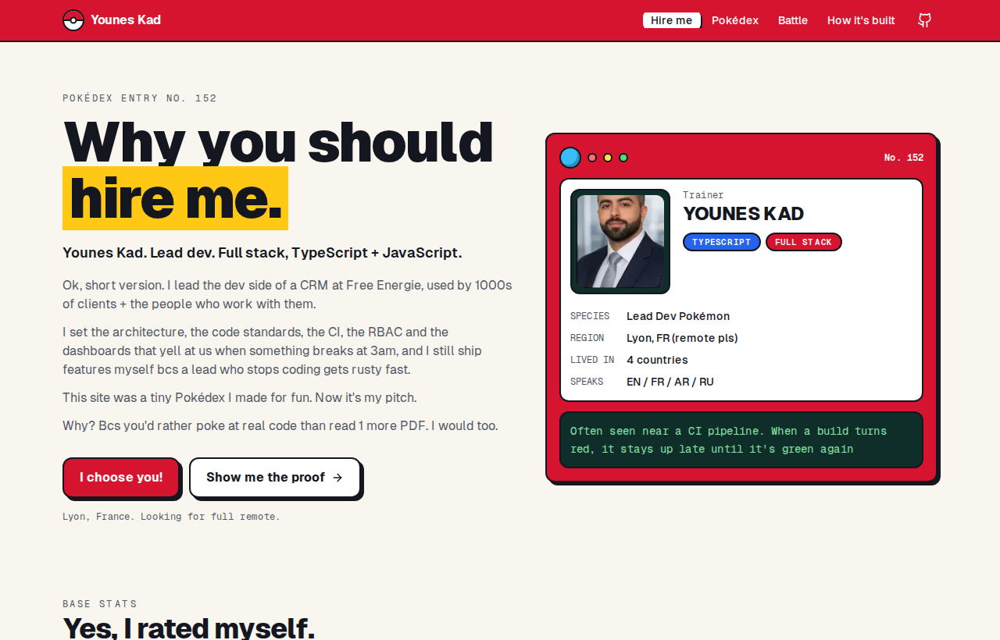
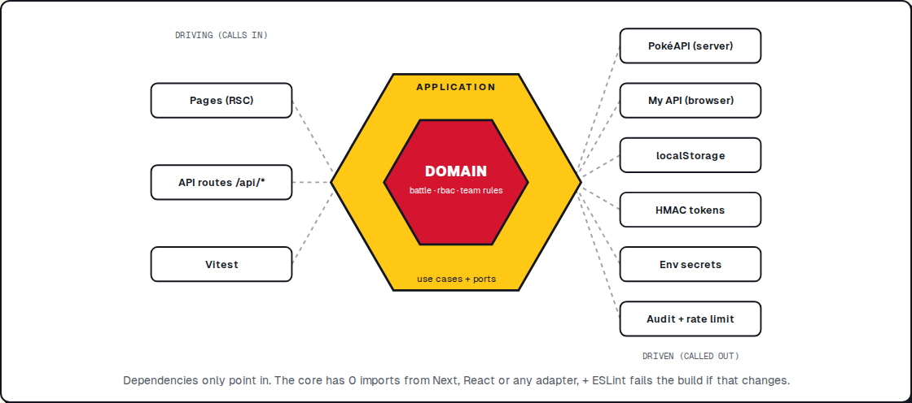

# Why you should hire me

**Live:** https://pokedex-nextjs14-lyart.vercel.app/



Hey. I'm **Younes Kad**, lead dev, full stack, TypeScript + JavaScript. Based in Lyon, looking for full remote.

This repo started as a small Pokédex I built for fun with Next.js 14. Then I had a thought. Why send 1 more PDF when I could send something you can actually click, break + read the code of? So I rebuilt it as my pitch. Same Pokémon. But now with the architecture, the tests and the security I'd bring to your team, bcs that's the stuff a CV can't really show.

## What's in here

| Route           | What it is                                                                          |
| --------------- | ----------------------------------------------------------------------------------- |
| `/`             | The pitch. My CV as a Pokédex entry: base stats, moves, type matchups, history      |
| `/pokedex`      | The original project, cleaned up. 151 Pokémon, search, detail pages with evolutions |
| `/battle`       | Build a team of 6, then fight an AI that reads the type chart                       |
| `/architecture` | How it's built + a live API playground where you can get a 403 on purpose           |

## Run it

```bash
npm ci
cp .env.example .env.local   # then put a real AUTH_SECRET in there
npm run dev
```

Open http://localhost:3000. Go to `/architecture`, hit `/api/contact` + you get a 403. Log in with the recruiter code from your `.env.local`. Hit it again. 200.

That's RBAC in 10 seconds.

## Architecture: hexagonal

Short version: bcs frameworks change, business rules don't.

I've watched framework upgrades, gateway swaps + data migrations at work, and the code that hurt every time was the code where the rules were glued to the framework. So here the rules sit in the middle and don't know Next.js exists.



```
src/
├─ core/                    the hexagon. no next, no react, no fetch
│  ├─ domain/               pure rules: battle engine, rbac policy, team rules
│  └─ application/          ports.ts (what the core needs) + use cases
├─ adapters/
│  ├─ driving/http/         request -> use case, error -> status code
│  └─ driven/               pokeapi, api-client, security, storage, audit, contact, content
├─ composition/             the ONLY place that plugs adapters into ports
├─ app/                     next.js routes. pages + 1 line api routes
└─ ui/                      react components. no business rules in there
```

It's not just a folder convention. ESLint blocks any import of `next`, `react` or `@/adapters/*` from inside `src/core`, so if someone breaks the boundary, CI goes red. See [`.eslintrc.json`](.eslintrc.json).

My favorite detail: the `PokemonCatalog` port has 2 adapters. On the server it talks to PokéAPI. In the browser it talks to my own API. The use cases (like "recruit a Pokémon with 4 random moves") run on both sides + have no idea which one they got.

Longer reasoning in [docs/adr/0001-hexagonal-architecture.md](docs/adr/0001-hexagonal-architecture.md).

## API + RBAC

3 roles. 5 permissions. 1 policy file ([`src/core/domain/access/rbac.ts`](src/core/domain/access/rbac.ts)). Deny by default, no "admin skips the check" shortcut.

| Permission     | visitor | recruiter | admin |
| -------------- | :-----: | :-------: | :---: |
| `profile:read` |    ✓    |     ✓     |   ✓   |
| `pokedex:read` |    ✓    |     ✓     |   ✓   |
| `contact:read` |         |     ✓     |   ✓   |
| `coach:use`    |    ✓    |     ✓     |   ✓   |
| `audit:read`   |         |           |   ✓   |

| Method   | Path                 | Needs          |
| -------- | -------------------- | -------------- |
| `GET`    | `/api/health`        | nothing        |
| `GET`    | `/api/flags`         | nothing        |
| `GET`    | `/api/me`            | nothing        |
| `POST`   | `/api/auth/session`  | an access code |
| `DELETE` | `/api/auth/session`  | nothing        |
| `GET`    | `/api/profile`       | `profile:read` |
| `GET`    | `/api/pokemon`       | `pokedex:read` |
| `GET`    | `/api/pokemon/:name` | `pokedex:read` |
| `GET`    | `/api/moves/:name`   | `pokedex:read` |
| `GET`    | `/api/contact`       | `contact:read` |
| `GET`    | `/api/admin/audit`   | `audit:read`   |
| `POST`   | `/api/coach`         | `coach:use`    |
| `GET`    | `/api/route`         | nothing        |
| `POST`   | `/api/events/hire`   | nothing        |

The spec for all of this lives in [`openapi/openapi.yaml`](openapi/openapi.yaml). It's written first: the TypeScript SDK in `src/sdk` is generated from it (`npm run sdk:generate`), the browser code calls the API through that SDK, a contract test fails if a route + the spec drift apart, + CI fails if the generated file is stale.

A few things I did on purpose:

- My phone number is **not** in this repo. It comes from env + only goes out to roles with `contact:read`.
- Sessions are HMAC signed, sent as an `HttpOnly`, `SameSite=Lax` cookie (+ `Secure` in prod). Kind of a JWT with no header, so no `alg: none` games.
- Access codes are compared in constant time. Login is rate limited to 5 tries a minute + only accepts JSON.
- Every denied call lands in an audit log. No IPs, just the role, the action + the result.

Why like this: [docs/adr/0002-rbac-and-sessions.md](docs/adr/0002-rbac-and-sessions.md).

## Tests + CI

```bash
npm test            # vitest, 150+ tests, a couple of seconds
npm run lint        # incl. the hexagon boundary rule
npm run typecheck   # strict mode
npm run eval:coach  # AI eval bench
npm run ci          # lint + types + tests + prod build

cd services/telemetry-gateway && go test -race ./...
cd services/anomaly && python -m pytest
```

The tests go from the pure battle engine all the way to the http layer. The http tests build a real `Request`, send it through the same code the route files use + check status codes, cookies and headers. No server running, no Next.js mocking.

[GitHub Actions](.github/workflows/ci.yml), on every push + PR:

| job     | what                                                                                                         |
| ------- | ------------------------------------------------------------------------------------------------------------ |
| checks  | lint, typecheck, vitest, SDK vs spec, prod build                                                             |
| ai-eval | the coach graded on fixed teams. rule baseline always, Claude too when the `ANTHROPIC_API_KEY` secret is set |
| go      | gofmt, vet, tests with the race detector (incl. 10 000 simulated devices)                                    |
| python  | pytest on the anomaly detector                                                                               |
| docker  | builds the image, starts it, curls `/api/health`                                                             |
| e2e     | Cypress on a prod build + axe, WCAG 2.1 AA, on every page it visits                                          |
| load    | k6, 20 users for 30s. p95 over 500ms or 1% errors = red                                                      |

A unit test also checks every type badge color against the WCAG contrast formula, bcs axe caught white on light blue once + I don't want it back. PRs get a [template](.github/pull_request_template.md) with the checklist I use at work.

## The ops side (straight from my CV)

My CV says feature flags, canary releases, structured logs + Docker. Talk is cheap, so here they are, running.

**Feature flags + canary.** 2 flags right now: `smart-ai` (the battle AI that reads the type chart) and `shiny-sprites`. A flag can be on/off, limited to some roles, or rolled out to a % of people. The % part is a real canary: every visitor gets an anonymous bucket cookie + a hash puts them in 0..99, so the same person always sees the same thing. No flicker. Want the smart AI for 20% of people? `FEATURE_FLAGS='{"smart-ai":{"enabled":true,"rolloutPercent":20}}'`, redeploy, done. The logic is pure domain code in [`flags.ts`](src/core/domain/flags/flags.ts) + tested (a test checks 25% really lands around 25%).

**Observability.** Every API call gets a request id (kept from your gateway if it looks sane, generated if not), an `x-request-id` + `server-timing` header, and 1 JSON log line:

```json
{
  "time": "...",
  "level": "info",
  "event": "http_request",
  "service": "hire-me",
  "requestId": "74a7dd1b-...",
  "method": "GET",
  "path": "/api/health",
  "status": 200,
  "durationMs": 2,
  "role": "visitor"
}
```

A crash returns the request id to the client, so a bug report points at the exact log line. `/api/health` gives status + version + uptime for load balancers.

**Docker.** Multi stage, Next standalone output, non root user, healthcheck. Same image runs on Cloud Run or anything else that takes a container.

```bash
docker build -t hire-me .
docker run -p 8080:8080 -e AUTH_SECRET="$(openssl rand -base64 48)" hire-me
```

## AI coach, MCP + evals

Build a team on `/battle`, hit **Rate my team**.

The core first turns the team into numbers: which attack types hit 2+ of your pokemon super effectively, what your moves cover, who did the damage last fight. The model gets those numbers + the type chart as docs, so it doesn't guess. It answers with structured output (verdict, threats, fixes, mvp), streamed to the browser as server-sent events, then validated with Zod on my side. A threat type that doesn't exist gets rejected.

It doesn't go down with the API. Claude Opus 5.5 first, with server side fallback turned on in case a safety filter declines. If that call fails (timeout, 5xx, bad json) it switches to Claude Sonnet 5.5. If that fails too, a plain rule engine answers. The UI shows every switch. No API key on a deploy = the rule engine answers + says so.

**Evals.** [`evals/coach`](evals/coach): fixed teams with real gen 1 stats, checks graded by code, not by another LLM. Right verdict, a real threat found, no fake threat, an mvp that's actually on the team. CI runs it on every push. Heads up: with the `ANTHROPIC_API_KEY` secret set, every CI run makes a handful of real API calls.

**MCP server.** Same use cases, another driving adapter:

```json
{
  "mcpServers": {
    "hire-me-pokedex": { "command": "npx", "args": ["tsx", "mcp/server.mts"], "cwd": "/path/to/Pokedex-Nextjs14" }
  }
}
```

5 tools: `search_pokemon`, `get_pokemon`, `plan_gym_tour`, `simulate_battle` (seeded, same seed = same fight) + `coach_team`. MCP callers get visitor rights only.

## Gym tour = a technician's round

Visiting every gym once + coming home is the same problem as planning a field technician's day (a TSP). [`route.ts`](src/core/domain/routing/route.ts): nearest neighbour to start, then 2-opt to untangle crossings. A test brute forces the real optimum on Kanto + checks we're within 5%. 200 stops still plan in well under a second. `/api/route?from=pallet`, drawn on `/architecture`.

## Services outside Next.js

**[`services/telemetry-gateway`](services/telemetry-gateway) (Go, stdlib only).** Battle events come in as NDJSON, get validated, rate limited per device (token bucket), batched, + handed to a `Sink` interface. In prod that's a Kafka producer. Here it writes NDJSON bcs there's no broker on this deploy. `/metrics` in Prometheus format for Grafana, 4x hits pushed to browsers over SSE. A test fires 10 000 simulated devices at it: 100k events, 0 lost.

**[`services/anomaly`](services/anomaly) (Python, stdlib only).** Reads that NDJSON from a pipe. Damage outliers per device with a robust z-score (median + MAD, so 1 huge value can't drag the average + hide itself) + devices bursting way above the fleet.

```bash
cd services/telemetry-gateway
go run ./cmd/gateway | (cd ../anomaly && python -m anomaly.detect)
go run ./cmd/simulate -devices 10000   # in another terminal
```

## Webhooks, Slack, Keycloak, tracing

- **Signed webhooks + Slack.** HIRE clicks + recruiter logins go to Slack + to a webhook signed like Stripe: `t=timestamp,v1=hmac`. The timestamp is inside the signature so an old request can't be replayed. 1 target down never blocks the others.
- **Keycloak.** Set `OIDC_ISSUER` + `OIDC_AUDIENCE` + bearer tokens from a Keycloak realm work next to my own sessions. JWKS signature, issuer, audience, expiry, RS256/ES256 only (a test tries the HS256-with-the-public-key trick). Realm roles `hireme-recruiter` / `hireme-admin` map to my roles.
- **OpenTelemetry.** 1 span per API request, the trace id is in every log line. Point `OTEL_EXPORTER_OTLP_ENDPOINT` at a collector + you get traces in Grafana Tempo (or Datadog, Honeycomb...).
- **OWASP.** [`docs/security/owasp-top-10.md`](docs/security/owasp-top-10.md) maps each risk to the code that handles it, + lists what's not done.

## What's NOT in here

Some things on my CV + in job offers can't run on a free Vercel deploy, so I didn't fake them: no Kafka broker or TimescaleDB (the gateway has the `Sink` seam for it), no dbt, no NestJS/PostGIS, no Stripe, no Elasticsearch, no GraphQL federation, no React Native app, no AWS CDK stacks. Happy to talk about how I'd build any of them.

## Env vars

| Name                             | What for                                                       |
| -------------------------------- | -------------------------------------------------------------- |
| `AUTH_SECRET`                    | signs sessions. 32+ chars. `openssl rand -base64 48`           |
| `RECRUITER_ACCESS_CODE`          | the code I send to recruiters. unset = nobody gets the role    |
| `ADMIN_ACCESS_CODE`              | mine                                                           |
| `CONTACT_PHONE`                  | shown to recruiter + admin only                                |
| `CONTACT_WHATSAPP`               | same                                                           |
| `FEATURE_FLAGS`                  | json overrides for the flags. broken json = defaults, no crash |
| `ANTHROPIC_API_KEY`              | turns on the Claude coach. unset = rule engine only            |
| `SLACK_WEBHOOK_URL`              | where HIRE clicks + recruiter logins get posted                |
| `WEBHOOK_URL` + `WEBHOOK_SECRET` | signed outbound webhook                                        |
| `OIDC_ISSUER` + `OIDC_AUDIENCE`  | accept Keycloak bearer tokens                                  |
| `OTEL_EXPORTER_OTLP_ENDPOINT`    | where traces go                                                |

Bad config crashes at boot with a clear message. Better than a weird 500 3 days later.

## What I'd change for a real prod

The audit log + rate limiter live in memory, so they reset on deploy and don't share between instances. Redis for the limiter + structured logs for the audit would fix it, and each one is just 1 new adapter. I'd also swap the access codes for a real identity provider behind the `TokenService` port. No CSP header yet either (see the OWASP grid).

## Stack

Next.js 14 (app router), TypeScript strict, Tailwind + shadcn/ui, framer-motion, Zod, Anthropic SDK, MCP SDK, OpenAPI + openapi-fetch, jose, OpenTelemetry, Vitest, Cypress + axe, k6. Go 1.24 + Python 3.11 for the services. Data from [PokéAPI](https://pokeapi.co).

## Contact

- younes.kadi@epitech.eu
- [youneskad.dev](https://www.youneskad.dev/)
- [LinkedIn](https://www.linkedin.com/in/younes-k-b2927b261/)

Pokémon is © Nintendo / Game Freak. Fan project, not affiliated.
